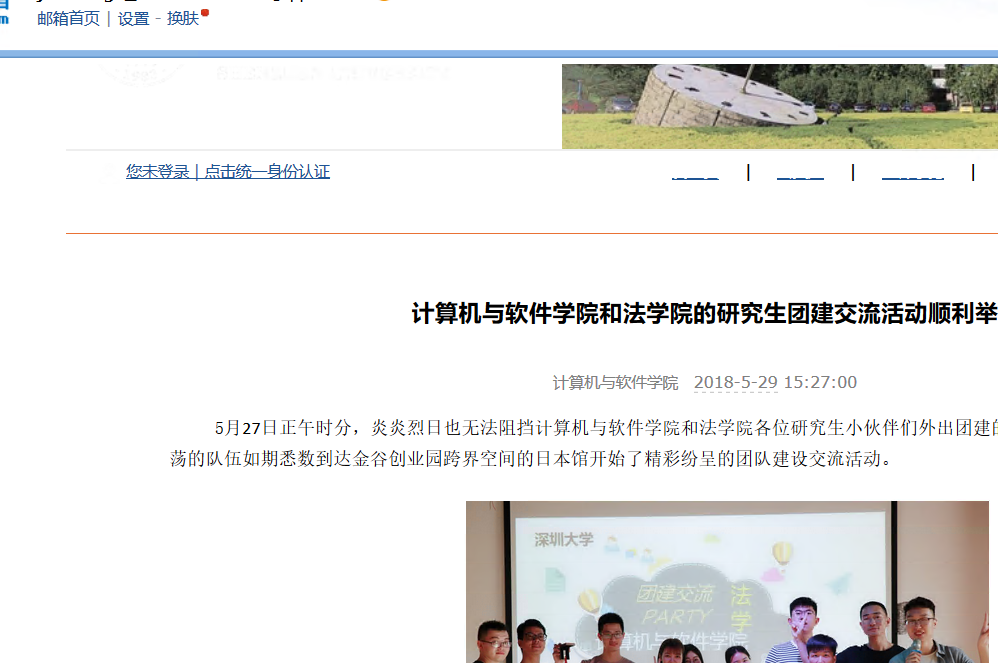

# szuReplite
每天定时8:00爬取学校公文通，发送计算机与软件学院的公文通邮件到自己邮箱

## 主要技术
* Quartz----定时任务
* HttpClient----模仿http请求，获取html
* 线程池
* JavaMail----发送邮件
* Mysql----储存url，避免发送重复信息

## 文件作用
* DbUtil----数据库操作
* HtmlGetter----访问url获取对应html，将相对路径转为绝对路径
* Mail----发送邮件
* MainJob----主要任务，主要逻辑的控制
* QuartScheduler----定时任务
* UrlSelector----从公文通中获取计算机与软件部分的url

## 流程
1. 主程序入口QuartScheduler定时8:00执行任务MainJob
2. MainJob爬取学校公文通html，UrlSelector使用正则表达式解析获取计算机与软件学院的公文通urls
3. MainJob线程池使用多个线程HtmlGetter访问urls获取相应html，将html中相对路径转为绝对路径
4. MainJob获取子线程访问结果组成邮件主题内容，Mail发送邮件

## 执行结果

